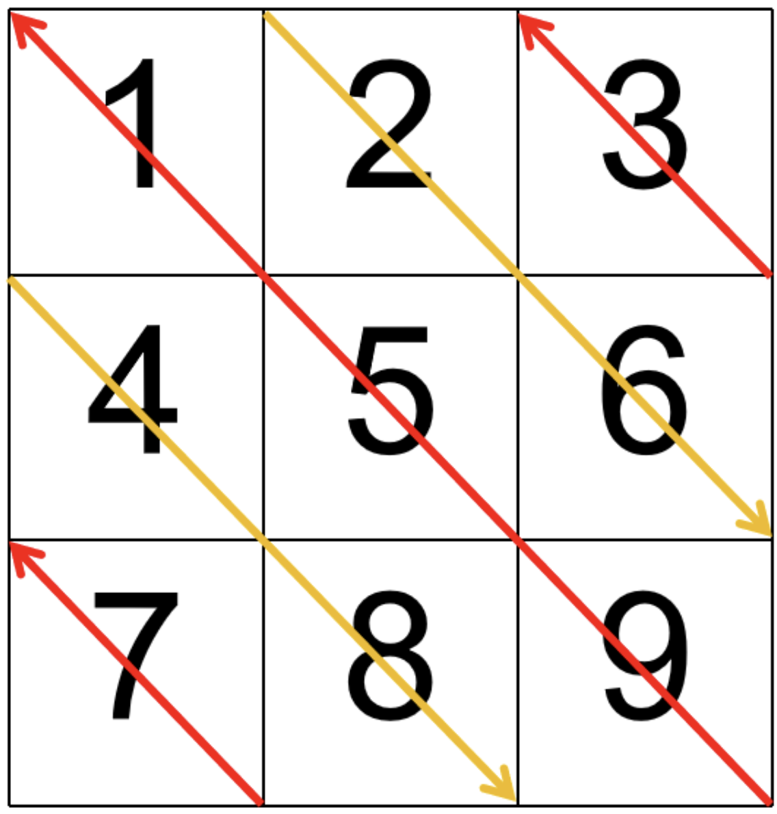

# 机考笔试 - 数据结构

##  数学技巧

### 24 落地成盒

- 美团，算法策略，26-04-11，第4批，1 / 4

**题目内容**

给定一个长度为 $n$ 的整数数组 $\{a_1, a_2, \dots, a_n\}$。我们按顺序将相邻元素两两成“盒”：  

- 盒 1 为 $(a_1, a_2)$，盒 2 为 $(a_3, a_4)$，以此类推；

- 若 $n$ 为奇数，则最后一个盒为单元素盒 $(a_n)$。  

你需要恰好选择 $x$ 个盒，并从每个被选择的盒中选出且仅选出一个数字，使得所有被选数字的和为奇数。判断是否可以做到。  

**输入描述**

每个测试文件均包含多组测试数据。第一行输入一个整数 $t$（$1 \le t \le 10^4$）代表数据组数，每组测试数据

描述如下：

第一行输入两个整数 $n, x$（$1 \le n \le 2 \times 10^5$，$1 \le x \le \left [ \frac{n}{2} \right ]$）

第二行输入 $n$ 个整数 $a_1, a_2, \dots, a_n$（$0 \le a_i \le 10^9$）

除此之外，保证单个测试文件的 $n$ 之和不超过 $2 \times 10^5$

**输出描述**

对于每组测试，若存在可行选择，输出 `Yes`；否则输出 `No`

**样例1**

输入

```
3
5 2
1 2 3 4 5
3 1
1 3 5
5 3
2 2 2 2 2
```

输出

```
Yes
Yes
No
```

原理，*见 notability*

```python
import sys

t = int(input())
for _ in range(t):
    n,x = list(map(int,input().split()))
    odd = 0
    even = 0
    mix = 0
    data = list(map(int,input().split()))
    stop = n
    if n%2 == 1: # 奇数个
        if data[-1] % 2== 1:
            odd += 1
        else:
            even += 1
        stop -= 1
    i=0 # [0,stop-1]
    while i<=stop-1:

        is1= data[i]%2==1 # 第一个是否是奇数
        is2 = data[i+1]%2==1 # 第二个是否是奇数
        if is1 and is2:
            odd += 1
        elif is1 or is2:
            mix +=1
        else:
            even +=1
        i+=2

    if mix >= 1:
        print("Yes")
        continue
    t1 = max(0, x - even)
    t2 = min(x,odd)
    if t2-t1 >=1:
        print("Yes")
    elif t2-t1 == 0 and t1 % 2 == 1:
        print("Yes")
    else:
        print("No")

```

---

### 25 风不吹雨

- 美团，算法策略，26-03-28，第3批，1 / 4

**题目内容**

给定一个长度为 $n$ 的整数序列 $a_1, a_2, \dots, a_n$

你可以对序列中的某些位置做操作。每个位置最多做一次操作 1，最多做一次操作 2（两种都做也可以，顺序任意），也可以完全不操作。两种操作如下：  

- 操作 1：选择一个位置 $i$，把 $a_i$ 变为 $\left\lfloor \frac{a_i}{2} \right\rfloor$（也就是除以 2 再向下取整）

- 操作 2：选择一个位置 $i$，把 $a_i$ 变为 $a_i - k$（注意：允许变成**负数**） 

你最多可以执行操作 1 共 $a$ 次，最多可以执行操作 2 共 $b$ 次。请你选好如何操作，使最终序列所有元素之和尽可能小，输出这个最小可能的和。  

**输入描述**

每个测试文件均包含多组测试数据。第一行输入一个整数 $T$（$1 \le T \le 2 \times 10^5$）代表数据组数，每组测试数据描述如下：  

第一行输入四个整数 $n, a, b, k$（$1 \le n \le 2 \times 10^5$，$0 \le a \le n$，$0 \le b \le n$，$1 \le k \le 10^9$）

第二行输入 $n$ 个整数 $a_1, a_2, \dots, a_n$（$1 \le a_i \le 10^9$）

除此之外，保证单个测试文件中所有测试数据的 $n$ 之和不超过 $4 \times 10^5$

**输出描述**

对于每组测试数据，新起一行输出一个整数，表示最小可能的最终元素和（这个数可能为负数）

**样例1**

输入

```
3
3 1 1 3
5 1 7
1 1 1 5
9
1 0 1 10
3
```

输出

```
6
-1
-7
```

```python
import sys
import math

T = int(input())
for _ in range(T):
    n, a, b, k = map(int,input().split())
    data = list(map(int,input().split()))
    ans = sum(data)
    ans -= b*k
    sorted_data = sorted(data,key=lambda p:-p)
    for i in range(a):
        ans -= math.ceil(sorted_data[i] / 2)
    print(ans)
```

---

### 27 小美的因子数量

- 美团，算法策略，26-03-14，第1批，1 / 4

**题目内容**

小美很喜欢因子数量为奇数的数。现在小芳给了小美一个区间 $[l, r]$，请你帮小美算出区间内有多少个因子数量为奇数的数

**名词解释**

因子：对于正整数 $a$，如果存在正整数 $p$ 使得 $a$ 能被 $p$ 整除，则称 $p$ 是 $a$ 的因子。例如，12 的因子有 1, 2, 3, 4, 6, 12

**输入描述**

第一行输入两个整数 $l, r(1 \le l \le r \le 10^9)$，表示询问的区间

**输出描述**

输出一个整数，表示区间内因子数量为奇数的数的个数

**样例1**

输入

```
1 1
```

输出

```
1
```

**样例2**

输入

```
4 5
```

输出

```
1
```

```python
import sys

l,r = map(int, sys.stdin.readline().split())
from math import sqrt
import math

print(math.floor(sqrt(r)) - math.ceil(sqrt(l))+ 1)
```

---

### 31 无限循环

- 美团，算法策略，26-03-21，第2批，1 / 4

**题目内容**

小美有一个长度为 $n$ 的数组 $\{a_1,a_2,\ldots,a_n\}$ 她为了研究这个数组做出了个大胆的决定。现在，将与初始数组完全相同的数组连续拼接到其末尾，共拼接 $10^9$ 次。设拼接完成后的新数组记为 $a'$，则新数组的长度为 $n\times (10^9+1)$，并且对于任意的 $n<i\le n\times (10^9+1)$，都有
$$
a'_i=a'_{i-n}
$$

请你计算新数组 $a'$ 的最长严格递增子序列的长度，并输出这个长度

**名词解释**

子序列：从原序列中删除任意个（可以为零、可以为全部）元素后按原相对顺序得到的新序列

严格递增子序列：子序列中相邻元素的值严格递增，即若子序列为 $\{b_1,b_2,\ldots,b_k\}$，则对所有 $1\le i<k$，都有 $b_i<b_{i+1}$

**输入描述**

每个测试文件均包含多组测试数据，第一行输入一个整数 $T(1\le T\le 10^4)$ 代表数据组数，每组测试数据描述如下：

第一行输入一个整数 $n(1\le n\le 2\times 10^5)$，表示原数组的长度

第二行输入 $n$ 个整数
$$
a_1,a_2,\ldots,a_n \quad (1\le a_i\le n)
$$
表示原数组的元素

除此之外，保证单个测试文件的 $n$ 之和不超过 $2\times 10^5$

**输出描述**

对于每一组测试数据，新起一行，输出一个整数，表示新数组的最长严格递增子序列长度

**样例1**

输入

```
2
4
1 1 2 3
5
4 5 3 3 4
```

输出

```
3
3
```

```python
t = int(input())
for _ in range(t):
    n = int(input())
    nums = list(map(int,input().split()))
    a = set(nums)
    print(len(a))
```


## 矩阵

### 33 对角线遍历矩阵

给你一个大小为 $m\times n$ 的矩阵 mat，请以对角线遍历的顺序，用一个数组返回这个矩阵中的所有元素，对角线遍历的顺序如图所示



**输入描述**

第一行包含两个整数 $m$ 和 $n$，表示矩阵的行数和列数（$1\leq m,n\leq 100$）

接下来的 $m$ 行，每行包含 $n$ 个整数，表示矩阵的元素（整数范围在 $[-10000,10000]$ 之间）

**输出描述**

输出一行，包含按对角线遍历顺序排列的矩阵元素，元素之间用空格隔开

**样例**

输入

```
3 3
1 2 3
4 5 6
7 8 9
```

输出

```
7 4 8 9 5 1 2 6 3
```

代码（AC）

```python
def get_diagonal(i,j, reverse):
    res = []
    while i <= m-1 and j <= n-1:
        res.append(matrix[i][j])
        i += 1
        j += 1
    if reverse:
        res.reverse()
    return res

m, n = list(map(int, input().split()))
matrix = [list(map(int, input().split())) for _ in range(m)]
res = []
reverse = True

# 起点位于左边界，不包含左上角
for i in range(m-1, 0, -1):
    tmp = get_diagonal(i, 0, reverse)
    res.extend(tmp)
    reverse = not reverse

# 起点位于上边界，包含左上角
for j in range(0, n, 1):
    tmp = get_diagonal(0, j, reverse)
    res.extend(tmp)
    reverse = not reverse

ans = " ".join(map(str, res))
print(ans)
```


## 滑动窗口

### 2 基于样本纯净度指标的大模型训练数据清洗方法

- 华为：26-01-21，ai 岗，编程题1/2

**题目内容**

在大规模文本语料收集和 $OCR$ 处理环节，常会在每条样本中残留重复的页眉、页脚、广告标记或爬虫抓取时的模板片段，这些重复内容对模型训练质量影响极大

我们考虑一个简化的场景：我们希望用“最长无重复子字符串	”（即样本中最长的一段不含任何重复字符的连续片段）来量化一条文本的“纯净度”

直观地讲，最长无重复子串越短，说明这条样本中重复噪声越严重，越应优先清洗或剔除

给定一条原始文本样本 $s$，其中可能包含大量重复的页眉 / 页脚或爬虫模板噪声

请你计算并返回其最长无重复子字符串的长度，作为该样本的“纯净度指标”

**输入**

字符串 $s$，由 ASCII 字母、数字构成。不会有空格。长度 $n$ ($1 \le n \le 10^7$)

**输出**

一个整数，表示 $s$ 中最长的不含重复字符的子串的长度

**样例1**

输入

```
aA1aA1bB2
```

输出

```
6
```

说明

最长非重复内容为 aA1bB2

**样例2**

输入

```
tttttttttt
```

输出

```
1
```

说明

重复同一个字符，最长子字符串为 $1$

**提示**

尝试使用时间复杂度 $O(n)$，空间复杂度 $O(\min(n, V))$（其中 $V$ 为字符集大小），否则可能无法拿到全部分数

```python
s = input().strip().strip()
ans = 0
left = 0
mp = {}
for i,ch in enumerate(s):
    if ch in mp and mp[ch] >= left:
        left = mp[ch] + 1
    mp[ch] = i
    ans = max(ans,i-left+1)
print(ans)
```

就是 *leetcode 3 无重复字符的最长子串*

这里的“时间复杂度”指的是算法辅助空间，如 `mp`

**输入本身占用**为 `O(n)`，这里 `s` 需要先输入

- 时间：$O(n)$，因为遍历一遍 `s`，中间那些计算都是常数次的

- 空间：$O(\min (n,V))$，即：当前窗口中的不同字符

  本题实际情况：数字（10）+ 大写（26）+ 小写（26），因此其实是常数级的，$O(1)$

读入数据，不要写 `data = list(input())`，会额外创建一个长度为 $n$ 的 list，内存翻倍（字符串 + list），对 $10^7$ 级别数据非常危险

> 因为该语句在执行时会有两步：
>
> ① `s = input()`
>
> 此时内存中已有一个字符串
>
> ② 转为 list：`data = list(s)`
>
> 此时同时存在字符串和list
>
> 并且字符串紧凑存储，每个字符大约 1~4 字节。list 存 n 个指针（8字节 × n）


## 回溯

### 23 获取大写字母瓷砖拼出独特图案数量

- 华为 od，26-04-29

**题目内容**

在一个创意设计工坊中，设计师希望用不同的大写字母瓷砖拼出独特图案，给定一个只包含大写英文字母的图案字符串 $L$，要求你给出对 $L$ 重新排列的所有不相同的图案，但是有以下约束条件：

1. 相同的字母不能相邻

**输入描述**

输入一个长度不超过 $12$ 的字符串 $L$，确保都是大写的

**输出描述**

输出满足约束条件的 $L$ 重新排列的所有不相同的排列数

**样例1**

输入

```
"AAB"
```

输出

```
1
```

**样例2**

输入

```
""
```

输出

```
1
```

说明：空也是符合没有相邻的要求

**样例3**

输入

```
"AA"
```

输出

```
0
```

说明：AA 是相邻的，所以没有满足条件的

```python
class Solution:
    def countValidPatterns(self, L: str) -> int:
        if L == "":
            return 1
        from collections import Counter
        mp = Counter(L)
        used = {}

        for ch in mp.keys():
            if ch not in used:
                used[ch] = 0
        n = len(L)
        self.ans = 0
        def backtrack(used, path):# path 目前使用的字母总数
            if len(path) == n:
                self.ans += 1
                return
            for ch in mp:
                if mp[ch] > used[ch] and (not path or path[-1] != ch):
                    used[ch] += 1
                    path.append(ch)
                    backtrack(used, path)
                    used[ch] -= 1
                    path.pop()
        backtrack(used, [])

        return self.ans
```


## 贪心

### 30 镜像串

- 美团，算法策略，26-04-25，第6批，1 / 4

**题目内容**

给定一个仅由小写英文字母组成的字符串 $s$。你可以选择至多一次，对任意一个连续区间 $[l, r]$（$1 \le l \le r \le |s|$）执行如下“镜像”操作：将区间内每个字符 $c$ 替换为 $\text{mirror}(c)$，其中  
$$
\text{mirror}(c) = \text{'a'} + (\text{'z'} - c)
$$

即有 $\text{'a'} \leftrightarrow \text{'z'}$、$\text{'b'} \leftrightarrow \text{'y'}$、$\text{'c'} \leftrightarrow \text{'x'}$、$\ldots$、$\text{'m'} \leftrightarrow \text{'n'}$

你也可以选择不进行任何操作。请在至多一次操作后，使得到的字符串按字典序尽可能小，并输出该最小结果。  

**名词解释**

字典序：按通常的字母顺序比较字符串，从左到右逐字符比较，先出现更小字符的字符串更小；若一方为另一方前缀，则更短者更小

镜像操作：对区间内每个字符 $c$ 映射为 $\text{mirror}(c) = \text{'a'} + (\text{'z'} - c)$

**输入描述**

每个测试文件包含多组测试数据。第一行输入一个整数 $T$（$1 \le T \le 10^5$）表示数据组数

接下来 $T$ 行，每行一个字符串 $s$，满足 $s$ 仅包含小写英文字母，且 $1 \le |s| \le 10^5$

保证所有测试中字符串长度之和不超过 $2 \times 10^5$

**输出描述**

输出 $T$ 行，每行一个字符串，表示在至多一次镜像操作后可得到的字典序最小字符串

**样例1**

输入

```
5
abcxyz
aaaa
zyx
az
b
```

输出

```
abccba
aaaa
abc
aa
b
```

```python
mp = {chr(ord('a')+i):i+1 for i in range(26)}
rev = {i+1:chr(ord('a')+i) for i in range(26)}

t = int(input())
for _ in range(t):
    data = list(input().strip())
    n = len(data)

    # 找第一个 >=14 的位置
    i=0
    while i < n and mp[data[i]] <= 13:
        i = i+1
    if i == n:
        print("".join(data))
        continue
    start = i
    while i < n and mp[data[i]] >= 14:
        data[i] = rev[27 - mp[data[i]]]
        i += 1
    print("".join(data))
```


## 动态规划

### 1 大模型训练显存优化算法

- 华为 26-03-18，ai 岗，编程题1/2

**题目描述**

在大模型训练中，为解决 NPU 显存不够用的情况，通常采用张量 swap 或者张量重计算的方式进行优化；张量 swap 是把张量的数据先搬到 CPU，需要的时候，再从 CPU 搬回 NPU；张量重计算是在需要张量的值时，在 NPU 上重新把张量的值计算出来。

* 假设把模型部署到 NPU 上，还需要 $m$ 大小的存储空间，才能让大模型运行起来；
* 目前有 $n$ 个候选张量，每个张量占用一定的存储空间；
* $n$ 个张量中的每个张量都可以进行 swap 或者重计算，swap 和重计算分别对应不同的代价；
* 试着编写一段程序，从 $n$ 个候选张量中选择合适的张量进行 swap 或者重计算，在代价最小的情况下，使得大模型能够运行起来(选择的张量和大于等于 $m$ )。

**输入描述**

第一行为1个整数 $m(0 < m < 10000)$，表示需要的存储空间大小

第二行为1个整数 $n(0 < n < 10000)$，表示候选张量的个数

第三行有 $n$ 个处于区间 $[1, 10000]$ 之内的整数，表示 $n$ 个候选张量的存储空间大小

第四行有 $n$ 个处于区间 $[1, 100000]$ 之内的整数，表示 $n$ 个候选张量 swap 的代价

第五行有 $n$ 个处于区间 $[1, 100000]$ 之内的整数，表示 $n$ 个候选张量重计算的代价

**输出描述**

如果没有找到合适的解，输出 `error`；否则，输出最小代价（行尾没有空格）

**样例 1**

输入

```
10
5
3 4 5 6 7
1 2 3 5 5
2 3 4 5 6
```

输出

```
6
```

**样例 2**

输入

```
12
4
18 20 10 12
12 3 13 4
10 14 10 1
```

输出

```
1
```

```python
m = int(input())
n = int(input())
sizes = list(map(int, input().split()))
swap_costs = list(map(int, input().split()))
recompute_costs = list(map(int, input().split()))

# 每个张量如果被选，就一定选更便宜的那种方式
costs = [min(swap_costs[i], recompute_costs[i]) for i in range(n)]

INF = float('inf')

# dp[i][j]：只使用前 i 个张量，能释放 >=j 空间的最小代价
dp = [[INF] * (m + 1) for _ in range(n + 1)]
# 第一行肯定是都是 inf
dp[0][0] = 0

for i in range(1, n + 1):
    size = sizes[i - 1]
    cost = costs[i - 1]

    for j in range(m + 1):
        # 不选第 i 个张量
        dp[i][j] = min(dp[i][j], dp[i - 1][j])

        # 选第 i 个张量
        if dp[i - 1][j] != INF:
            new_j = min(m, j + size)   # 超过 m 就压到 m
            dp[i][new_j] = min(dp[i][new_j], dp[i - 1][j] + cost)

# 输出答案
if dp[n][m] == INF:
    print("error")
else:
    print(dp[n][m])
```

`dp[i][j]` 只用前 $i$ 个张量，恰好释放空间为 $j$（但当 $j\geq m$ 时，都视为 $j=m$）

0-1背包问题

> 从 $n$ 个张量里选一些，使得总释放空间至少为 $m$，总代价最小

状态转移方程：

- 不选第 $i$ 个张量：
  $$
  \text{dp}[i][j] = \text{dp}[i-1][j]
  $$

- 选第 $i$ 个张量，大小是 `size`，代价是 `cost`

  新释放量变成 $j+\text{size}$，但超过目标 $m$ 后都统一压成 $m$：
  $$
  \text{new}_j = \min(m, j+\text{size})
  $$
  故：
  $$
  \text{dp}[i][\text{new}_j] = \min(\text{dp}[i][\text{new}_j],\ \text{ dp}[i-1][j] + \text{cost})
  $$

  >如果 $j+\text{size} \leq m$，这个状态转移方程很好理解，就是
  >$$
  >\text{dp}[i][j + \text{size}] = \min(\text{dp}[i][j + \text{size}],\; \text{dp}[i-1][j] + \text{cost})
  >$$
  >就是从状态 $\text{dp}[i-1][j]$ 转移到 $\text{dp}[i][j+\text{size}]$

  因此需要先判断状态 $\text{dp}[i-1][j]$ 是否是可达的，**只有当状态是可达的，我们才允许它转移**


---


### 3 模型推理量化加速优化问题

- 华为 26-02-04，ai 岗，编程题1/2

**题目描述**

深度学习模型的推理量化问题，该模型包含多个全连接层，每个层可以选择不同的量化方案（16-bit 量化、8-bit 量化），不同方案会带来不同的内存占用和精度损失。  

需要选择模型最优的量化方案组合，在满足总精度损失约束的前提下最小化内存占用。

本题考虑 16 bit，8 bit 量化两种场景

在给定的如下条件：  

每层在不同位宽下的精度损失（如 8 位量化时，第 $i$ 层的精度损失为 $loss_i$）  

每层在不同位宽下的内存占用（如 8 位量化时，第 $i$ 层的内存占用为 $mem_i$）  

模型整体的精度损失不能超过阈值 $T$  

请设计一个算法，为每层选择最优量化位宽，使得总内存占用最小且满足总精度损失小于（**等于**） $T$

**输入描述**

第一行：整数 $L$（层数）和浮点数 $T$（精度损失阈值）  

接下来 $L$ 行，每行描述一层的量化选项：  

整数 $K$（该层可选的量化位宽数量）  

$K$ 组数据，每组包含：位宽描述字符串（8 bit 和 16 bit）、精度损失（浮点数）、内存占用（浮点数）  

**输出描述**

最优总内存占用（保留两位小数）

**样例1**

输入

```
3 0.3
2 8bit 0.2 100.0 16bit 0.1 200.0
2 8bit 0.3 150.0 16bit 0.1 300.0
1 8bit 0.1 150.0
```

输出

```
650.00
```

说明

3 层，满足精度阈值 0.3

第一层，2 种量化位宽数量，8 bit 精度损失 0.2，内存 100；16 bit 精度损失 0.1，内存 200

第二层，2 种量化位宽数量，8 bit 精度损失 0.3，内存 150；16 bit 精度损失 0.1，内存 300

第三层，1 种量化位宽数量，8 bit 精度损失 0.1，内存 150

满足 0.3 精度损失的最优内存占用为 650

第一层 16 bit，精度损失 200

第二层 16 bit，精度损失 300

第三层 8 bit，精度损失 150

总共内存占用 200 + 300 + 150 = 650

**样例2**

输入

```
2 0.5
2 8bit 0.2 100.0 16bit 0.1 200.0
2 8bit 0.3 150.0 16bit 0.15 300.0
```

输出

```
250.00
```

说明

2 层，精度阈值为 0.5

第一层，2 种量化位宽数量，8 bit 精度损失 0.2 内存 100；16 bit 精度损失 0.1 内存 200

第二层，2 种量化位宽数量，8 bit 精度损失 0.3 内存 150；16 bit 精度损失 0.15 内存 300

满足 0.5 精度损失的最优内存占用为 250

第一层 8 bit，精度损失 0.2，内存占用 100

第二层 8 bit，精度损失 0.3，内存占用 150

总共内存占用 100 + 150 = 250

```python
L,T = input().split() # L为层数
L = int(L)
T = float(T)

layers = []
for _ in range(L):
    data = input().split()
    K = int(data[0])
    idx = 2
    options = []
    for _ in range(K):
        loss = float(data[idx])
        mem = float(data[idx + 1])
        options.append((loss,mem))
        idx += 3
    layers.append(options)

# 扩大数据100倍
T1 = int(T*100+0.5) # 注意这个技巧
# dp[i][j] 只使用前i层，loss为j时的最小内存
INF = float('inf')
dp = [[INF]*(T1+1) for _ in range(L+1)]

dp[0][0] = 0

for i in range(1,L + 1):
    for m in range(len(layers[i-1])): # 会有多个可以的选择
        loss = int(layers[i-1][m][0]*100+0.5)
        mem = layers[i-1][m][1]
        for j in range(T1+1):
            if j-loss >= 0 and dp[i-1][j-loss] != INF:
                dp[i][j] = min(dp[i][j], dp[i-1][j-loss] + mem)

ans = min(dp[L][i] for i in range(T1+1))
print(f"{ans:.2f}")
```

`data = input().split()` 会得到

```
["2", "8bit", "0.2", "100.0", "16bit", "0.1", "200.0"]
```

这里 `8bit`、`16bit` 是没有用的信息

`dp[0][0] = 0` 第一列其他的要保留，因为有可能每一层都有一个方案是 loss = 0 的，但是选这个方案的话，这一层确实也是有选的

需要保证每一层都选一个方案

---


### 8 AIGC缓存复用加速策略

- 华为：26-02-04，ai 岗，编程题2/2

**题目内容**

Stable / Diffusion为代表的图像和视频生成模型采用了一种逐步优化的方法：模型会多次迭代运行同一个核心算法，将初始的随机噪声逐步优化成清晰的图像或视频。随着对生成质量和视频时长要求的提高，核心算法的迭代步数持续增大，导致该方法的计算量急剧增加（计算量与步骤数成正比），造成应用部署困难。

为了降低计算负载，可以采用“缓存复用”策略：研究发现，相邻步骤的特征往往相似，当第 $t$ 步和第 $t+1$ 步的特征高度相似时，我们可以直接复用第 $t$ 步的计算结果，跳过第 $t+1$ 步的计算。对于总共 $T$ 步的优化过程，如果跳过 $k$ 步，计算量就能降低为原来的 $(T-k)/T$。

然而，跳过步骤会带来图像和视频生成质量的损失。用一个长度为 $T-1$ 的损失值列表来记录跳过每一个步骤所带来的损失：列表中的第 $t$ 个元素（$0 \le t < T$）表示在第 $t+1$ 步时复用第 $t$ 步的计算结果（即跳过第 $t+1$ 步计算）所导致的损失值。为了保证生成质量，不能连续跳过 $2$ 个及以上步骤（即不能连续复用）。请设计一个函数，在给定总迭代步骤数 $T$、需要跳过的步骤数 $k$，以及损失值列表的情况下，寻找最优的跳过策略，输出最小的总损失值。

**输入描述**

1. $T$：正整数 $T$，表示总迭代步骤数（$1 < T \le 1000$）。
2. $k$：正整数 $k$，表示需要跳过的步骤数（$0 \le k < T$）。
3. loss：损失值列表，以空格分隔的 $T-1$ 个正整数。第 $t$ 个值（$0 \le t < T$）表示跳过第 $t+1$ 步（复用第 $t$ 步的计算结果）所带来的损失值。每个损失值均为小于 $1000$ 的正整数。

**输出描述**
output：如果没有找到合适的解，输出 $-1$；否则输出最小的总损失值。

**样例1**

输入

```
6
2
2 1 2 4 5
```

输出

```
4
```

说明
跳过第 $1$ 个步骤和第 $3$ 个步骤，总损失值为 $2 + 2 = 4$。由于不能连续跳过 $2$ 个步骤，因此不能跳过步骤 $1$ 和步骤 $2$，或跳过步骤 $2$ 和步骤 $3$。

**样例2**

输入

```
6
4
2 1 2 4 5
```

输出

```
-1
```

说明

总迭代步骤数为 $5$ 时，无法跳过 $4$ 个不连续的步骤，因此返回 $-1$。

```python
T = int(input().strip())
k = int(input().strip())
loss_list = list(map(int,input().split()))

n = T-1 # “可跳过的位置”的第1,...,n个

if k >(n+1) // 2:
    print(-1)
    return

INF = float('inf') # 要求最小，因此设为正无穷表示不可达

# dp[i][j][s] 考虑到第i个“可跳过位置”，已经跳过了j步，状态为s，0:不跳，1:跳时的最小loss
dp = [[[INF]*2 for _ in range(k+1)] for _ in range(n+1)]
dp[0][0][0] = 0
for i in range(1,n+1): # 第i个"可跳过位置"
    for j in range(k+1): # 即使当前已经考虑了很多位置，也可能仍然一个都没跳过
            loss = loss_list[i-1]
            # 这一步不跳
            dp[i][j][0] = min(dp[i-1][j][0], dp[i-1][j][1])

            # 这一步跳
            if j >= 1 and dp[i-1][j-1][0] != INF:
                dp[i][j][1] = dp[i-1][j-1][0] + loss

ans = min(dp[n][k][1],dp[n][k][0])
if ans == INF:
    print(-1)
else:
    print(ans)
```

可跳过的步骤为：2 ~ T

典型的“当前位置决策会影响后一个位置状态”的**动态规划模型**

这道题其实**不用考虑**第1个步骤，直接就是一共 $n=  T-1$ 个“可跳过位置”即可，很多的背景信息都是无用的

`dp[i][j][s]` 表示现在考虑到下标为 $i$ 的位置，已经跳过了 $j$ 个步骤，当前这个位置的状态为 $s$，这时的总 loss

$s=0$：第 $i$ 个位置**没有跳过**

$s=1$：第 $i$ 个位置**跳过了**

- **样例2无解的原因**

  $T=6$，可选跳过位置数 $n=T-1=5$。要选 $k=4$ 个

  长度为 5 的，不相邻最多只能选：
  $$
  \left\lceil \frac{5}{2} \right\rceil = 3
  $$
  因此无解

  对于一般的可选跳过位置数 $n = T-1$，$k$ 的最大值为
  $$
  k >\left\lceil \frac{n}{2} \right\rceil =  \left\lceil \frac{T-1}{2} \right\rceil
  $$

---


### 12 最大能量路径

- 华为，25-10-22，ai 岗，编程题 1/2 

**题目内容**

在自动驾驶系统中，车道线识别是核心功能之一。车道线通常具有连续性，从图像左侧到右侧逐渐展开。

为了识别出最可能的车道线路径，我们可以在图像中找到一条路径，使得路径上所有像素的信号值与策略矩阵的乘积之和最大。

现定义每个位置的能量值为策略矩阵与该位置周边信号值的乘积和。

给定一个 $H \times W$ 的图像以及一个 $K \times K$ 的策略矩阵，用于模拟不同方向的路径选择策略。

你需要从图像的第一列任意像素出发，走到最后一列任意像素，每一步只能向**右、右上、右下**移动一格。

在行进的过程中，需要实时的收集能量值，请找到一条路径，使得路径上的能量值之和最大。

**输入描述**

第一行输入 $H\ W\ K\ K$，分别表示给定图像及策略矩阵的维度

接下来

$H$ 行输入图像矩阵

$K$ 行输入策略矩阵

**输出描述**

输出最大能量值

**样例1**

输入

```
1 1 1 1
5
1
```

输出

```
5.0
```

说明

有且仅有一条路径，最大能量值为 $5 * 1$ 为 $5.0$

**样例2**

输入

```
3 3 3 3
1 2 3
4 5 6
7 8 9
1 2 2
1 1 1
1 1 1
```

输出

```
119.0
```

说明

输入第一行是一个 $3 \times 3$ 的图像以及 $3 \times 3$ 的策略矩阵

每个位置的能量图：

$[[12.21.16.]$

$[30.50.36.]$

$[33.50.34.]]$

最大能量路径的值：119.0 最大能量路径：$(2,0) \to (1,1) \to (1,2)$ 

提示

1. 策略矩阵为奇数，边缘处用零填充
2. 输出保留一位小数

```python
H, W, K, _ = map(int,input().split())
graph = [list(map(float, input().split())) for _ in range(H)] # 注意这里初始化的方式，矩阵其实就是嵌套列表，甚至每一行的长度不一样都没什么影响
strategy = [list(map(float, input().split())) for _ in range(K) ]

wid = K // 2
graph_pad = [[0.0] * (W + 2*wid) for _ in range(H + 2*wid)] # 没有必要用numpy
for i in range(H):
    for j in range(W):
        graph_pad[i+wid][j+wid] = graph[i][j]
# 后面用 graph_pad

energy = [[0.0]*W for _ in range(H)] # 初始化为浮点型
for i in range(H):
    for j in range(W):
        total = 0
        for u in range(K):
            for v in range(K):
                total += graph_pad[i + u][j + v] * strategy[u][v]
        energy[i][j] = total

NEG_INF = float('-inf')
ans = NEG_INF
dp = [[NEG_INF] * W for _ in range(H)] # H * W

for i in range(H):
    dp[i][0] = energy[i][0]
for j in range(1,W):
    for i in range(H): # 按列来推进
        if i-1>=0:
            dp[i][j] = max(dp[i][j], dp[i-1][j-1] + energy[i][j])
        if i+1 <= H-1:
            dp[i][j] = max(dp[i][j], dp[i+1][j-1] + energy[i][j])

        dp[i][j] = max(dp[i][j], dp[i][j-1] + energy[i][j])

ans = max(dp[i][W-1] for i in range(H))
print(f"{ans:.1f}")
```


## 二叉树

### 18 统计二叉树中“平衡路径”的数量

- 华为：26-04-22，ai，编程题1/2

**题目内容**

定义二叉树的平衡路径需同时满足以下 3 个条件：

1. 路径从任意节点出发，仅能向下延伸（只能向左/右子节点，不可向上回溯）。
2. 路径上所有节点的和相加为 $0$。
3. 路径长度（包含的节点个数）至少为 $2$。

请实现一个 Python 函数，输入二叉树的根节点（按层序遍历规则构建），返回该树中所有“平衡路径”的总数。

注意：

建树规则：层序遍历列表按「从上到下、从左到右」的顺序构建二叉树，None 表示对应位置无节点。

路径延伸：从起点出发，仅沿左子节点 OR 右子节点单向向下（单链，不可分叉）。

统计方式：每个符合条件的单链路径独立计数（即使路径有重叠）。

**输入描述**

二叉树的层序遍历列表（元素为整数或 None，None 表示空节点）

**输出描述**

整数，表示平衡路径的总数

**样例1**

输入

```
[10, -5, -5, 2, -2, 3, -3]
```

输出

```
0
```

**样例2**

输入

```
[0, 0, None]
```

输出

```
1
```

**样例3**

输入

```
[1, -1, 2, -2, None, 3, -3]
```

输出

```
2
```

AC 解答

```python
class TreeNode:
    def __init__(self, val):
        self.val = val
        self.left = None
        self.right = None

tree_str = input() # [10, -5, -5, 2, -2, 3, -3]
tree_str = tree_str[1:-1] # 10, -5, -5, 2, -2, 3, -3
tree_str_arr = tree_str.split(',')

if tree_str == "":
    print(0)
    exit(0)

tree_arr = [] # 转换为数字版本
for str in tree_str_arr:
    str = str.strip()
    if str == "None":
        tree_arr.append(None)
    else:
        tree_arr.append(int(str))

if tree_arr[0] is None: # 不要写not tree_arr[0]，第一个元素可能是0
    print(0)
    exit(0)

def build_tree(nums): # 返回根节点
    from collections import deque
    if not nums or nums[0] == None:
        return None
    root = TreeNode(nums[0]) # root肯定不是None
    q = deque([root])
    i = 1 # 正在处理的节点，在数组中的下标
    n = len(nums)
    while q and i<n:
        node = q.popleft()
        # 左孩子
        if i < n and nums[i] is not None: # i<n用于保护nums[i]
            node.left = TreeNode(nums[i])
            q.append(node.left)
        i += 1

        # 右孩子
        if i < n and nums[i] is not None:
            node.right = TreeNode(nums[i])
            q.append(node.right)
        i += 1

    return root

ans = 0
def backtrack(node):
    if not node:
        return
    find_sum_zero(node,0,0)
    backtrack(node.left)
    backtrack(node.right)

root = build_tree(tree_arr)

def find_sum_zero(node, total, length):
    if not node:
        return
    global ans
    total += node.val
    length += 1
    if length >= 2 and total == 0:
        ans += 1
    find_sum_zero(node.left, total, length)
    find_sum_zero(node.right, total, length)

backtrack(root)
print(ans)
```

- `find_sum_zero` 定义

  > 在已经选定**某个**起始节点的前提下，当前路径已经向下走到了 `node`，继续从 `node` 往下延伸，统计所有“路径和为 0 且长度至少为 2”的路径。


## 其他数据结构

### 11 实体匹配结果合并问题

- 华为：25-10-29，ai 岗，编程题1/2

**题目内容**

某业务部门有多个数据来源，现在需要对多个来源的实体数据进行去重、消歧、合并。有多个实体匹配系统（假设系统的匹配结果完全正确），每个系统从不同角度进行匹配，匹配结果是相同实体列表。

这些匹配结果中往往存在交叉重复的问题，需要对所有匹配结果进行合并去重。例如系统 A 的匹配结果是 "1", "2"，系统 B 的匹配结果是 "2", "3"，那么合并后的匹配结果是 "1", "2", "3"。请你按照上述逻辑，编写代码实现对匹配结果的合并去重。

**输入描述**

第一行输入是整数 $N$，表示有 $N$ 个实体匹配系统，$1\leq N \leq 10000$

接下来 $N$ 行是每个实体匹配系统的匹配结果（相同实体列表，每行实体数量不超过 100）；实体使用数字字符串表示（字符串长度不超过 10），实体之间通过空格分开。实体种类数量不超过 100000。

**输出描述**

输出 $M$ 行（$M \leq N$），每行内容是合并后的匹配结果

注意，每行的输出结果需要按照字典序进行排序；合并后的匹配结果列表之间，也需要按字典序进行排序

**样例1**

输入

```
5
1 2 3
4 5
11 22
33 44 55 1
3 66
```

输出

```
1 2 3 33 44 55 66
11 22
4 5
```

说明

匹配结果 "1 2 3"、"33 44 55 1"、"3 66"，存在重复实体 "1" 和 "3"，故可以合并，合并后按字典序为 "1 2 3 33 44 55 66"

另外两组结果与其他组不存在重复

合并后的匹配结果列表之间，按字典序排序后输出，即样例输出所示内容

**样例2**

输入

```
2
1 2
2 3
```

输出

```
1 2 3
```

说明

有两组匹配结果，即 "1 2" 和 "2 3"，存在重复实体 "2"，故可以合并为 "1 2 3"

```python
N = int(input().strip())

parent = [] # parent[i] = j 节点i的父节点是j
size = [] # 集合的大小
mp = {} # 字符串 -> 并查集编号，如
names = []       # 编号 -> 实体字符串

def add(x): # 返回并查集编号
    if x not in mp: # 将“字符”映射为数组“下标”
        idx = len(parent)
        mp[x] = idx
        parent.append(idx)
        size.append(1) # 单节点集合
        names.append(x)
    return mp[x]

def find(x):
    if parent[x] != x:
        parent[x] = find(parent[x])
    return parent[x]

def union(x, y):
    rx = find(x)
    ry = find(y)
    if rx == ry:
        return
    if size[rx] < size[ry]: # 为让 rx 始终是节点数量比较大的那个
        rx, ry = ry, rx
    parent[ry] = rx
    size[rx] += size[ry]

# 读入并合并
for _ in range(N):
    data = input().split()
    if not data: # 保护一下，以免出现空的一行
        continue

    first = add(data[0])
    for s in data[1:]:
        cur = add(s)
        union(first, cur)

# 按根节点分组
groups = {} # {根节点编号: 这一组的所有字符串}
for s, idx in mp.items():
    root = find(idx)
    if root not in groups:
        groups[root] = []
    groups[root].append(s)

# 每组内部按字典序排序
ans = []
for group in groups.values():
    group.sort()
    ans.append(group)

# 组与组之间按字典序排序
ans.sort()

# 输出
for group in ans:
    print(" ".join(group))

```

`mp = {}` 用于存储字符串对应的并查集编号，如

```python
mp = {
    "1": 0,
    "2": 1,
    "33": 2,
    "66": 3
}
```

`names = []` 存的是 编号 → 字符串，如

```python
names = ["1", "2", "33", "66"]
```

- 组与组之间的字典排序：

  ```python
  ans = [
      ["1","2","3","33","44","55","66"], # a
      ["11","22"], # b
      ["4","5"] # c
  ]
  
  ans.sort()
  ```

  "1" < "11"，故 $a<b$。"1" < "4"，故 $a<c$。"11" < "4"（先从第一个元素1和4比），故 $b<c$

  故 $a<b<c$，故排序后 ans 就是现在这样

#### 并查集

题目意思：每一行里的实体都属于同一个集合，如果两行之间有公共实体，那么这两行对应的集合要合并，最后输出所有连通块中的实体

即：是一个 **按“有交集就连边”来求连通分量** 的问题


## 未归类

### 28 数据清除

- 美团，算法策略，26-04-18，第5批，1 / 4

**题目内容**

小美正在清除残留数据，这个过程可以抽象成一个长度为 $n$ 的序列 $a$

小美会进行 $m$ 轮清洗：每轮她会删除序列中最小的数；如果有多个相同的最小数，则清除最靠前的那个数（即下标最小的那个）

请输出小美进行完 $m$ 轮清洗后的序列

**输入描述**

每个测试文件均包含多组测试数据：

第一行输入一个整数 $T(1\le T\le 2\times 10^5)$，代表数据组数

每组测试数据描述如下：

第一行输入两个整数 $n,m$（$1\le n\le 2\times 10^5$，$0\le m$）分别代表序列的长度和清洗轮数

第二行输入 $n$ 个整数 $a_1,a_2,\ldots,a_n(1\le a_i\le n)$，代表初始序列

除此之外，保证单个测试文件的 $n$ 之和不超过 $4\times 10^5$

**输出描述**

对于每一组测试数据，新起一行，输出最终的序列，元素之间用空格隔开

输入

```
3
5 2
3 1 4 1 5
3 0
1 2 3
5 4
5 4 3 2 1
```

输出

```
3 4 5
1 2 3
5
```

```python
T = int(input())
for _ in range(T):
    n,m = map(int,input().split()) # m:清洗轮数
    data = list(map(int,input().split()))
    keep = [True]*n
    data_sorted = sorted(
        [(v,i) for i,v in enumerate(data)],
        key=lambda p:(p[0],p[1])
    )

    for i in range(m):
        keep[data_sorted[i][1]] = False

    ans = []
    for i in range(n):
        if keep[i]:
            ans.append(data[i])
    print(*ans, sep=" ")
```

---

### 29 平稳风段

- 美团，算法策略，26-05-09，第7批，1 / 4

**题目描述**

给定长度为 $n$ 的风速序列 $a_1,a_2,\ldots,a_n$ 和阈值 $d$

定义连续段 $[l,r]$ 为“平稳段”，当且仅当对所有 $i\in [l,r-1]$，都有：
$$
|a_{i+1}-a_i|\le d
$$

请你输出所有平稳段的最大长度

**输入描述**

每个测试文件包含多组测试数据。第一行输入一个整数
$$
T(1\le T\le 2\times 10^5)
$$
表示数据组数，每组测试数据描述如下：

第一行输入两个整数 $n$ 和
$$
d(1\le n\le 2\times 10^5,\ 0\le d\le 10^9)
$$

第二行输入 $n$ 个整数
$$
a_1,a_2,\ldots,a_n \quad (|a_i|\le 10^9)
$$

保证所有测试数据的 $n$ 之和不超过 $2\times 10^5$

**输出描述**

对于每组测试数据，输出一行一个整数，表示最大平稳段的长度

```python
import sys

T = int(input())
for _ in range(T):
    n, d = map(int,input().split())
    nums = list(map(int, input().split()))
    if n == 1:
        print(1)
        continue

    a = [False]*(n-1)#相邻两个元素是否满足平稳条件
    for i in range(n-1):
        tmp = nums[i] - nums[i+1]
        if tmp <= d and tmp >= -d:
            a[i] = True
    b = [0]*(n-1) # 连续满足平稳条件的相邻边数量
    if a[0]:
        b[0]=1
    for i in range(1,n-1):
        if a[i]:
            b[i] = b[i-1] + 1
    print(max(b)+1)
```
